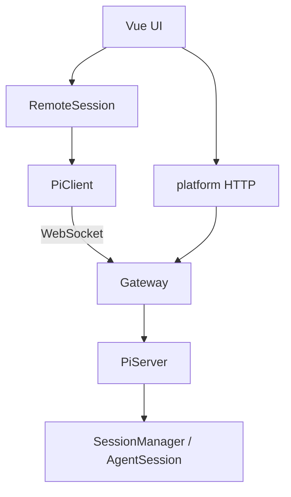
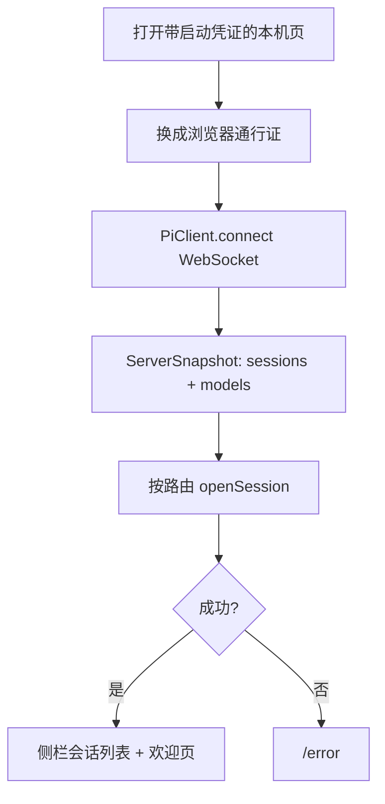
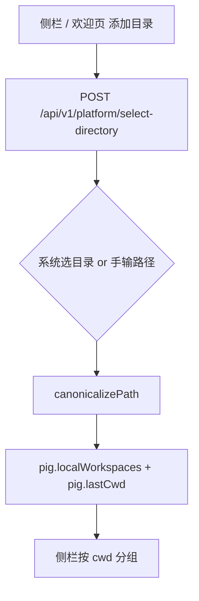
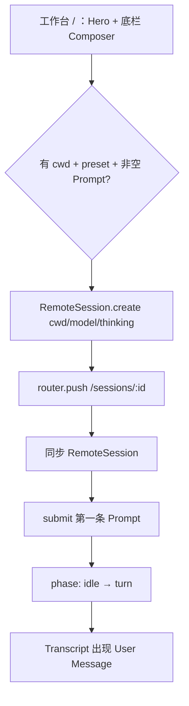
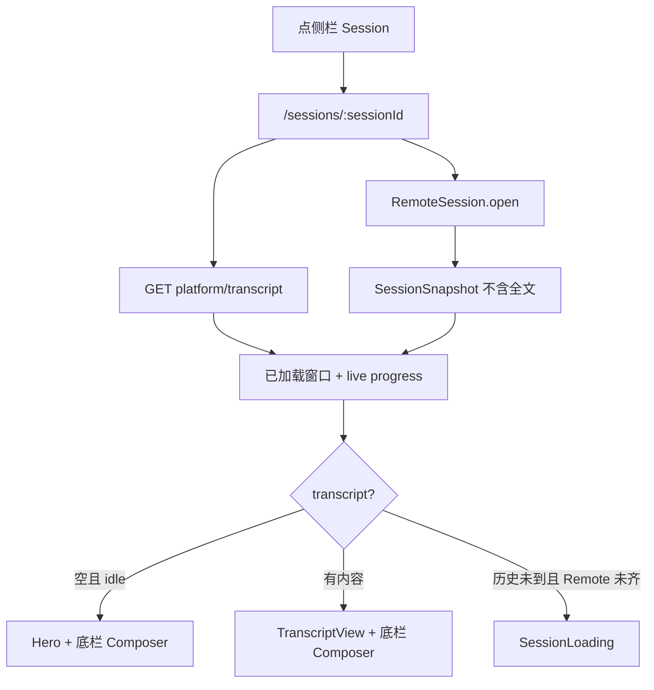
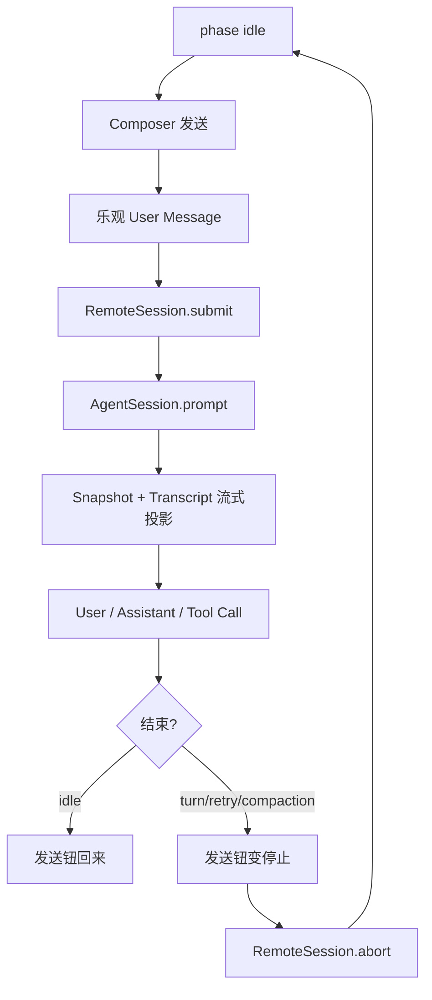
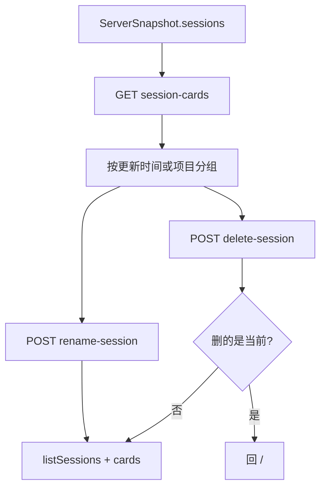
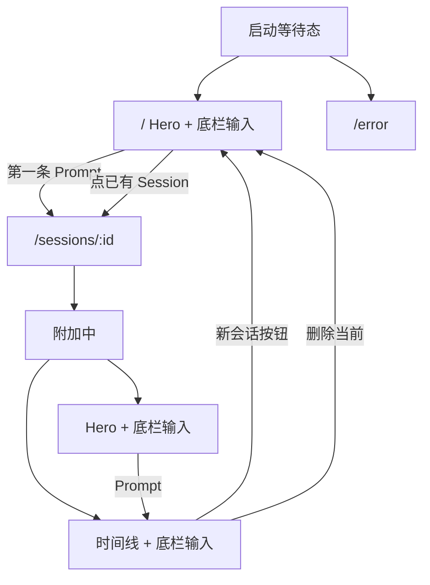

# 核心旅程

pig 把用户动作接到 Pi 的 Session，再把 Snapshot / Transcript 投到工作台。

两条总线：

- WebSocket（官方协议）：连接、Session 列表、创建/打开、Prompt / Abort、改 Model / Thinking。权威状态是 `ServerSnapshot` 和 `SessionSnapshot`。
- HTTP `/api/v1/platform/*`（Thin Host）：选目录、侧栏卡片、历史 Transcript、上下文占用、重命名、删除。不进 Agent Domain。

## 启动进工作台

e2e 对应 `01-startup` → `02-session-inbox`。

启动门和 Logo 动画并行。超时 8s 进 `/error`。Gateway 只绑 127.0.0.1。浏览器用一次性启动凭证换成通行证，之后的接口和 WebSocket 都要带上它。

## 选工作目录

Working Directory 限定 Session 范围。列表和 `lastCwd` 只活在浏览器。

会话列表来自 Pi。目录筛选来自本地偏好。两边按 canonical path 对齐。

## 欢迎页开新会话

路由 `/`，无 `sessionId`。这是主创建路径。

侧栏「新会话」只回到 `/`，不立刻建 Session。Session 在第一条 Prompt 时才创建。

## 打开已有会话

切 Session 会串行替换 lease。连点只落地最后一个 id。历史 HTTP 与 RemoteSession.open 并行：同一 Session 已 ready 或在飞不重复拉，revision 变化才再拉。未连接时 initialize 仍拉磁盘历史。打开只拉最后一轮；之后已加载窗口只增不缩，最新页接到尾巴，不整页替换。live progress 按 id 覆盖当前回合。空 snapshot 不冲掉已拉到的历史。hasMore 跟窗口第一条走，上翻再 prepend。

## 一轮工作

当前 UI 不做 Steering。运行中只能 Abort。协议里 `submit` 在 `turn` 时是 steer，Web 不走这条。

空闲时可改 Model / Thinking：`preset` → `setModel` / `setThinking`。不新建 Session，已有 Transcript 不变。

## 侧栏管理 Session

Session Name 是显示标签，不是身份。Delete Session 永久删除 Pi Session 和 Transcript。

辅助读路径：向上翻更早 Transcript、看 context usage。失败不挡主流程。

## 工作台状态

e2e 走到欢迎页和输入卡可用就停，不发真实 Turn。主题和窄屏抽屉是壳层，不进这条数据流。

协议有、当前 UI 没有：Steering、手动 Compaction、图片进协议、fork/clone。附件只停在输入卡。
