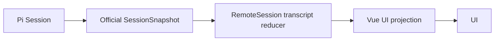
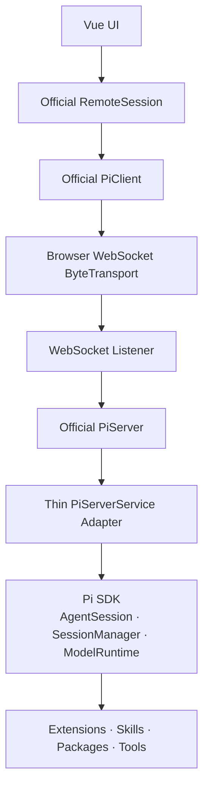

# ROADMAP

## 1. 产品定位

pig 不再定位为独立 Agent Runtime、Platform 或 Framework，而是：

> **一个遵循 Pi 设计哲学，不额外内置工具，完全通过 Extension API 扩展的 Pi Agent GUI。**

- pig 负责 Web 与 Desktop UI、平台接入和本地安全，不重新实现 Agent Loop、Session、Model Runtime 等已有能力。
- 完全保留 Pi 的原生体验，不做 git 版本管理、不做内置终端、不做内置浏览器，会话交互体验优先。
- 能力通过 Pi Extension API 扩展，支持动态拔插。

## 2. 核心原则

### Pi 管理 Agent 状态

Pi 负责：

- Agent Loop 与 AgentSession
- Session persistence 与 Transcript
- Prompt、Steer、Abort 与 Compaction
- Model、Provider、Thinking Level 与认证
- Tools、Tool execution 与 Agent events
- Extensions、Skills、Prompt Templates 与资源加载

pig 不再定义 `PigRun`、`PigSession`、`PigAgentEvent`、`PigTool`、`PigModel` 等平行抽象。

### 官方 Remote Protocol 提供跨进程状态

浏览器与 Node Host 之间直接使用 Pi 官方远程栈：

- `@earendil-works/pi-client`
- `@earendil-works/pi-protocol`
- `@earendil-works/pi-coding-agent/client`
- `@earendil-works/pi-server`

不自建 `PiClient`、wire protocol、事件 envelope 或 reconnect state machine。

`ServerSnapshot` 和 `SessionSnapshot` 是权威状态；`session_progress` 只用于低延迟展示，不作为持久事实源。重连后以新 Snapshot 覆盖本地投影。

### pig 只管理 UI 状态

pig 可以维护：

- 当前 Session、页面路由和加载状态
- Composer draft、滚动位置和 auto-follow
- panel、theme 和用户 UI preference
- Snapshot / Transcript 的展示投影

允许定义 `ToolActivityViewModel` 等展示模型，但不得将其持久化为第二套 Agent Domain。



### Thin Host

Node 侧只承担平台接入，细节见第 5 章。

### Extension-first

MCP、Subagent、Permission、Browser、Git、Terminal、Custom Tool 和 Workflow 优先实现为 Pi Extension、Skill 或 Package。只有 Pi 无法表达的 UI-only 能力才进入 pig core。

## 3. 目标架构



## 4. 官方客户端契约

UI 直接使用官方类型，不再声明 pig 版 `PiClient`：

```ts
import { PiClient, type ByteTransportFactory } from "@earendil-works/pi-client";
import { RemoteSession } from "@earendil-works/pi-coding-agent/client";
import type {
  ModelRef,
  SessionMetadata,
  SessionSnapshot,
  ThinkingLevel,
  TranscriptItem,
} from "@earendil-works/pi-protocol";
```

职责如下：

| 模块                   | 职责                                                                              |
| ---------------------- | --------------------------------------------------------------------------------- |
| `PiClient`             | 连接、重连、Session 列表、创建和附加 Session                                      |
| `RemoteSession`        | 打开/创建当前 Session、提交输入、Abort、切换 Model/Thinking、维护 Transcript 投影 |
| `ByteTransportFactory` | 将浏览器 WebSocket 适配为有序二进制传输                                           |
| `SessionSnapshot`      | 当前 Session 的权威状态、phase、model、thinking 和 transcript                     |
| `ServerSnapshot`       | Session metadata 与可用模型目录                                                   |

`RemoteSession.submit(text)` 在 `idle` 时发送 prompt，在 `turn` 时发送 steer。UI 不再维护独立的 Run 或 Steer 路径。

Web 与 Desktop 只替换 `ByteTransportFactory`，不重新定义 Agent interface。

## 5. Thin Host 契约

Host 使用官方 `PiServer`，只实现 `PiServerService` adapter：

```ts
interface PiServerService {
  listSessions(): Promise<SessionMetadata[]>;
  listModels(): Promise<ModelMetadata[]>;
  createSession(options: CreateSessionOptions): Promise<PiSessionRuntime>;
  openSession(sessionId: string): Promise<PiSessionRuntime>;
}
```

最薄映射：

| PiServer 操作   | Pi SDK 调用                                                                |
| --------------- | -------------------------------------------------------------------------- |
| `listSessions`  | `SessionManager.listAll()`                                                 |
| `listModels`    | `ModelRuntime.getAvailable()`                                              |
| `createSession` | `SessionManager.create(..., { id })` + `createAgentSession()`              |
| `openSession`   | 按 ID 查找 Session path + `SessionManager.open()` + `createAgentSession()` |
| `prompt`        | `AgentSession.prompt()`                                                    |
| `steer`         | `AgentSession.steer()`                                                     |
| `abort`         | `AgentSession.abort()`                                                     |
| `setModel`      | `ModelRuntime.getModel()` + `AgentSession.setModel()`                      |
| `setThinking`   | `AgentSession.setThinkingLevel()`                                          |

Adapter 只将 Pi SDK 状态和事件映射为官方 `SessionSnapshot` / `TranscriptProgress`，不得产生 Pig Event 或 Pig Run 状态。

WebSocket listener 必须在交给 `PiServer` 前完成认证，并限制 frame 和待发送数据大小。认证属于 transport security，不属于 Agent Domain。

## 6. 能力边界

必须保留：

- Session 列表、新建、打开与恢复
- Transcript、streaming output 与 thinking
- Prompt、运行中 Steer 与 Abort
- Tool activity、Model picker 与 Thinking level
- cwd/project selection
- Theme、Draft、Scroll、auto-follow 与错误展示

官方远程契约尚未提供以下能力。本轮不自研扩展协议：

- Tree、fork、clone 与 import
- 手动 compaction 与 follow-up queue
- 图片 prompt
- Extension UI dialog

### 事实源与平台边界

- Host 重启后，Session 状态仍从 Pi Session storage 读取。

> **最终判断顺序：官方 Pi SDK/Remote Protocol → Pi Extension → UI state → platform concern。**
>
> Pi 已拥有的能力，禁止在 pig 中重复实现。
