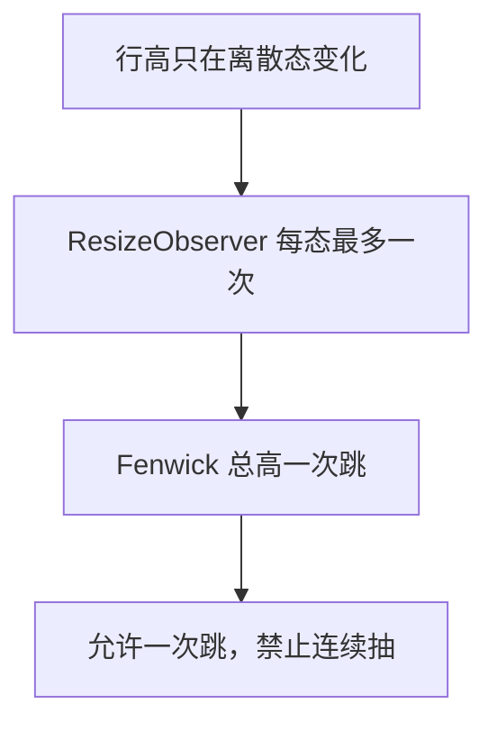

# Transcript 行高与滚动

虚拟时间线把行 DOM 高度写进总高和 `scrollTop`。思考折叠动画、展开 Tool Call、上翻历史时估高纠偏，都会让滚动条抽。

实施以本文为清单。视觉 token 仍走 `DESIGN.md`。产品外观仍走 `docs/ui-guidelines.md` 的 Transcript 段。

原则：测进 Markstream 的高度只允许离散态，不允许过渡态。库的贴底和锚点环不动。不 fork。

## 不做

- fork markstream，或给 ResizeObserver 打补丁
- Tool Call 外层高度动画、portal、把 `open` 抬到时间线只为估高
- 给 `PROGRAMMATIC_BOTTOM_HOLD_MS` 再加防抖
- Playwright 录滚动条拇指
- 单测锁估高算术（`toBe(48)` / `160` / `296` / `332` / `496`）
- 改 `onTranscriptWheel` 的 preventDefault（只在精确贴底抢一次轴，不是连续抖的主因）

## 根因

`measureRef` 绑在行根节点。Markstream 对每个已测行建 ResizeObserver，高度一变就改 Fenwick 总高，再按离底距离改 `scrollTop`：≤2px 强制贴底，≤48px 当视觉贴底，更远则保当前行锚点。

pig 现在往这条环里送过渡态：

- `ThinkingReasoning` 用 `grid-template-rows` 做 320ms 高度动画，约 20 帧都在改行高
- Tool Call 折叠估高恒为 48，展开 `v-if` 一次跳到几百
- 短助手估高 `Math.max(160, …)`。8 月 22 日为侧栏拖窄、按 200px 塞过多未测行而加。侧栏已松手再解冻、只量一次，保底过时。上翻历史时 160 纠到约 40，边滚边纠

`apps/web/test/transcript-view/transcript-layout.test.ts` 把 48 / 160 / 296 等实现数字锁死。改系数 CI 红，滚动条每帧抽仍绿。

## 目标态

```text
思考  流式/展开 = 标题 + 180 槽（增量在槽内滚）
      折叠     = 标题
      两态之间一帧切，opacity 可动，layout 不动

Tool  折叠 = 一行顶栏
      展开 = 顶栏 + 入参/输出（ExpandableText 已 32 行封顶）
      用户点击允许一次跳，外层不动画

估高  贴近折叠态。展开靠一次测量。
      短助手按字数估，去掉 160 保底。长文仍封顶。
```



## 思考

文件：`apps/web/src/features/transcript-view/components/ThinkingReasoning.vue`。

删掉 `.tr-collapsible` 的 `grid-template-rows` 过渡。流式时外高固定为标题加 `.tr-viewport` 的 180。结束一帧收到标题。用户再展开，一帧回到同一固定槽，槽内滚动。

`collapseSoon` 的 360ms 延迟可留（先出「思考了 Ns」再收），但收的时候不能插值高度。

估高跟两态对齐。不要再写流式 +200、结束后 +36。

## Tool Call

文件：`ToolCall.vue`。现有结构已接近目标：折叠一行，`v-if` 展开，输出走 `ExpandableText`。

不改为高度动画。估高只按折叠行。展开后让测量提交一次实高。

## 估高

文件：`apps/web/src/features/transcript-view/index.vue` 的 `estimateTranscriptRowHeight`。

- 思考占位行、折叠思考：标题高
- 流式且含 thinking：标题 + 180
- Tool Call、加载更早：折叠行高（与顶栏 `min-height: 36` 对齐，含卡片边距后约 40–48，取实测折叠高而不是「故意偏高」）
- 助手正文：按字数折行，**去掉** `Math.max(160, …)`。长文封顶 960 可留
- 注释改为：估高贴近折叠态，展开靠一次测量。under-estimate 由 `overscan=8` 和库的 `overscanPx` 覆盖

侧栏拖拽仍走现有「松手再解冻」，估高不再为它垫像素。

## 测试

文件：`apps/web/test/transcript-view/transcript-layout.test.ts`。扩展现有文件，不新建。

删掉锁算术的 `estimateTranscriptRowHeight` 用例。留下：

| 要防的失败 | 断言 |
| --- | --- |
| 思考外高不是两态 | 流式含 thinking 的估高 = 折叠估高 + 180。结束后折叠不再加槽 |
| 短助手被垫高 | 一句「答」的估高接近一行，远小于 160 |
| 贴底协议和库不一致 | 现有 2px / 48px / hold 窗口可留 |

不在单测里假扮 Fenwick 或 ResizeObserver。

## 文件

| 文件 | 改动 |
| ---- | ---- |
| `transcript-view/components/ThinkingReasoning.vue` | 外高两态，去掉 grid 高度过渡 |
| `transcript-view/index.vue` | 估高贴近折叠态，去掉 160 保底 |
| `transcript-view/components/ToolCall.vue` | 确认折叠一行、展开不动画，几乎不改 |
| `apps/web/test/transcript-view/transcript-layout.test.ts` | 策略断言替换魔术数 |
| `docs/ui-guidelines.md` | Transcript 段指向本文 |

## 实施顺序

1. 思考外高两态。这一步单独消掉思考时滚动条抽。
2. 估高去掉 160 保底，对齐两态。消掉翻历史边滚边纠。
3. 换测试。
4. `pnpm check:touched`。

Tool Call 展开会剩一次跳。那是用户点开卡片该有的。
