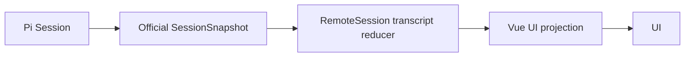
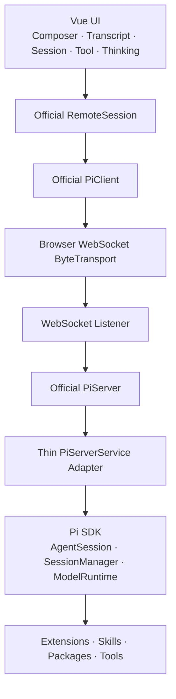

# pig 架构瘦身：重构为 Pi-first Web GUI

> Repository: `minuque/pig`
>
> 本文可直接作为重构任务 Prompt。执行前只需补充分支、范围或任务编号。

## 1. 产品定位

pig 不再定位为独立 Agent Runtime、Platform 或 Framework，而是：

> **一个 local-first、交互优秀、高性能的 Pi GUI。**

首版只实现 Web，后续可支持 Desktop。pig 负责 UI、平台接入和本地安全，不重新实现 Agent Loop、Session、Model Runtime、Tools、Transcript、Steer 或 Abort。

新增 Agent 能力时，优先使用 Pi Extension、Skill 或 Package，不向 pig core 添加第二套 Agent Runtime。

## 2. 核心原则

### Pi 拥有 Agent Truth

Pi 负责：

- Agent Loop 与 AgentSession
- Session persistence 与 Transcript
- Prompt、Steer、Abort 与 Compaction
- Model、Provider、Thinking Level 与认证
- Tools、Tool execution 与 Agent events
- Extensions、Skills、Prompt Templates 与资源加载

pig 不再定义 `PigRun`、`PigSession`、`PigAgentEvent`、`PigTool`、`PigModel` 等平行抽象。

### 官方 Remote Protocol 是跨进程 Truth

浏览器与 Node Host 之间直接使用 Pi 官方远程栈：

- `@earendil-works/pi-client`
- `@earendil-works/pi-protocol`
- `@earendil-works/pi-coding-agent/client`
- `@earendil-works/pi-server`

不自建 `PiClient`、wire protocol、事件 envelope 或 reconnect state machine。

`ServerSnapshot` 和 `SessionSnapshot` 是权威状态；`session_progress` 只用于低延迟展示，不作为持久事实源。重连后以新 Snapshot 覆盖本地投影。

### pig 只拥有 UI Truth

pig 可以维护：

- 当前 Session、页面路由和加载状态
- Composer draft、滚动位置和 auto-follow
- panel、theme 和用户 UI preference
- Snapshot / Transcript 的展示投影

允许定义 `ToolActivityViewModel` 等展示模型，但不得将其持久化为第二套 Agent Domain。



### Thin Host

Node 侧只负责：

- 将 Pi SDK 接入官方 `PiServerService`
- 提供 WebSocket listener
- 处理 localhost bootstrap、认证和进程生命周期
- 托管 Web 静态资源

Node 侧不再承担独立 Agent Domain。

### Extension-first

MCP、Subagent、Permission、Browser、Git、Terminal、Custom Tool 和 Workflow 优先实现为 Pi Extension、Skill 或 Package。只有 Pi 无法表达的 UI-only 能力才进入 pig core。

## 3. 版本决策

当前仓库锁定 Pi `0.83.0`，该版本尚无官方 Remote Protocol。重构第一步统一升级并精确锁定 Pi `0.84.1`：

```text
@earendil-works/pi-coding-agent  0.84.1
@earendil-works/pi-client        0.84.1
@earendil-works/pi-protocol      0.84.1
@earendil-works/pi-server        0.84.1
```

所有 Pi 包必须使用同一版本，不使用宽松版本范围。

这些远程接口仍标记为 experimental。只在 WebSocket transport 和 Host adapter 两处接触底层协议，避免版本变化扩散到 Vue UI。

## 4. 目标架构



首版调用链：

```text
Vue UI
→ RemoteSession
→ PiClient
→ WebSocket ByteTransport
→ PiServer
→ PiServerService adapter
→ Pi SDK
```

建议最终结构：

```text
pig/
├─ apps/web/                         # Web 入口
│  └─ src/platform/websocket.ts      # Browser ByteTransportFactory
├─ packages/ui/                      # 平台无关 Vue UI（Phase 2）
└─ packages/gateway/                 # PiServerService + WebSocket listener
```

不再创建 `packages/pi-client`。目录迁移分阶段进行，不为目录美观制造无意义 rename。

## 5. 官方客户端契约

UI 直接使用官方类型，不再声明 pig 版 `PiClient`：

```ts
import { PiClient, type ByteTransportFactory } from "@earendil-works/pi-client"
import { RemoteSession } from "@earendil-works/pi-coding-agent/client"
import type {
  ModelRef,
  SessionMetadata,
  SessionSnapshot,
  ThinkingLevel,
  TranscriptItem,
} from "@earendil-works/pi-protocol"
```

职责如下：

| 模块 | 职责 |
| --- | --- |
| `PiClient` | 连接、重连、Session 列表、创建和附加 Session |
| `RemoteSession` | 打开/创建当前 Session、提交输入、Abort、切换 Model/Thinking、维护 Transcript 投影 |
| `ByteTransportFactory` | 将浏览器 WebSocket 适配为有序二进制传输 |
| `SessionSnapshot` | 当前 Session 的权威状态、phase、model、thinking 和 transcript |
| `ServerSnapshot` | Session metadata 与可用模型目录 |

`RemoteSession.submit(text)` 在 `idle` 时发送 prompt，在 `turn` 时发送 steer。UI 不再维护独立的 Run 或 Steer 路径。

Web 与未来 Desktop 只替换 `ByteTransportFactory`，不重新定义 Agent interface。

## 6. Thin Host 契约

Host 使用官方 `PiServer`，只实现 `PiServerService` adapter：

```ts
interface PiServerService {
  listSessions(): Promise<SessionMetadata[]>
  listModels(): Promise<ModelMetadata[]>
  createSession(options: CreateSessionOptions): Promise<PiSessionRuntime>
  openSession(sessionId: string): Promise<PiSessionRuntime>
}
```

最薄映射：

| PiServer 操作 | Pi SDK 调用 |
| --- | --- |
| `listSessions` | `SessionManager.listAll()` |
| `listModels` | `ModelRuntime.getAvailable()` |
| `createSession` | `SessionManager.create(..., { id })` + `createAgentSession()` |
| `openSession` | 按 ID 查找 Session path + `SessionManager.open()` + `createAgentSession()` |
| `prompt` | `AgentSession.prompt()` |
| `steer` | `AgentSession.steer()` |
| `abort` | `AgentSession.abort()` |
| `setModel` | `ModelRuntime.getModel()` + `AgentSession.setModel()` |
| `setThinking` | `AgentSession.setThinkingLevel()` |

Adapter 只将 Pi SDK 状态和事件映射为官方 `SessionSnapshot` / `TranscriptProgress`，不得产生 Pig Event 或 Pig Run 状态。

WebSocket listener 必须在交给 `PiServer` 前完成认证，并限制 frame 和待发送数据大小。认证属于 transport security，不属于 Agent Domain。

## 7. 删除与替换

| 现有设计 | 处理方式 |
| --- | --- |
| `RunsApplication`、`RunScheduler`、`RunStateMachine`、`RunRepository` | 删除。 |
| `UiRun`、`RunStatus`、Run ID、Run recovery | 删除。工作状态使用 `SessionSnapshot.phase`。 |
| `SSEEventEnvelope`、sequence、gap recovery | 删除。由官方 PiClient 和 Snapshot 处理连接恢复。 |
| `run.output.delta`、`run.thinking.delta`、`run.tool.*` | 删除。改用官方 Transcript types 和 progress。 |
| `ModelPreset` | 删除。改用 `ModelRef + ThinkingLevel`。 |
| `commandId` 与命令去重 Domain | 删除。请求关联由官方 PiClient protocol 处理。 |
| Pig Session persistence | 删除。Session metadata、ID 和 transcript 以 Pi 为准。 |
| Workspace Domain | 删除。cwd/project selection 属于 Web platform；授权属于 transport security。 |
| SQLite Agent metadata | 删除。UI preference 使用简单 UI persistence。 |
| `useRuns()` | 删除。改为围绕 `RemoteSession` 和 UI projection 的组合式状态。 |
| 通用 REST/SSE API client | 删除。仅保留 bootstrap、目录选择等 Browser platform 请求。 |

前端状态流统一为：

```text
ServerSnapshot / SessionSnapshot / TranscriptProgress
→ RemoteSession
→ Vue projection
→ render
```

平台无关 UI 不得直接依赖 `fetch`、`WebSocket`、`sessionStorage`、`location`、Node APIs 或 Pi Host internals。

## 8. 执行阶段

### Phase 0：接入官方远程栈

先完成：

1. 将所有 Pi 包精确锁定到 `0.84.1`。
2. 引入官方 client、protocol 和 server。
3. 实现最小 Browser `ByteTransportFactory`。
4. 实现最小 `PiServerService` adapter。
5. 验证 create/open、prompt/stream、abort 和 reconnect。

完成后，其他任务再并行。

### Phase 1：替换旧 Host 与 UI State

| Task | 主要范围 | 目标 |
| --- | --- | --- |
| A — Thin Pi Host | `packages/gateway/**` 或 `packages/pi-host/**` | 删除旧应用层和数据库 Domain；接入 PiServerService、AgentSession 与 WebSocket listener。 |
| B — Web Transport | `packages/web/src/api/**`、`platform/**` | 删除 REST/SSE Agent client；创建官方 PiClient 并注入 WebSocket ByteTransport。 |
| C — Pi-native UI | `packages/web/src/app/**`、`features/**`、`components/**` | 删除 UiRun 和 recovery；使用 RemoteSession state、Snapshot 和 TranscriptItem，保留现有视觉与交互。 |

并行任务不得跨范围顺手删除公共文件。

### Phase 2：抽取 UI Core

Phase 1 稳定后，将 Web 拆成平台无关的 `@pig/ui` 与 Browser-only 的 `@pig/web`。暂不创建 Desktop。

### Phase 3：清理 Legacy

统一删除旧 contracts、dead code、旧 tests 和过时文档；更新 scripts 与架构文档；必要时将 gateway rename 为 pi-host。

## 9. 首版能力

必须保留：

- Session 列表、新建、打开与恢复
- Transcript、streaming output 与 thinking
- Prompt、运行中 Steer 与 Abort
- Tool activity、Model picker 与 Thinking level
- cwd/project selection
- Theme、Draft、Scroll、auto-follow 与错误展示

官方远程契约尚未提供以下能力。本轮不自研扩展协议：

- Session rename/delete
- Tree、fork、clone 与 import
- 手动 compaction 与 follow-up queue
- 图片 prompt
- Extension UI dialog

将这些能力记录为 upstream gap；官方契约支持后再接入。

本轮不要做 Desktop shell、自定义 Agent Loop、自研 Plugin System、新数据库 Domain、内置 MCP/Subagent/Browser/Git/Terminal/Permission、Cloud Backend、多用户 SaaS 或无明确需求的泛化抽象。

## 10. 质量与验收

所有修改必须通过 TypeScript typecheck、lint 和 tests。优先使用 Pi 官方类型，不用 `any` 绕过协议，不长期保留新旧架构双轨。

浏览器验收交给用户，不擅自启动服务。

### Prompt 调用链

```text
UI → RemoteSession.submit() → PiClient → PiServer → AgentSession.prompt()/steer()
```

链路中不存在 `RunsApplication`、`RunScheduler` 或 `RunStateMachine`。

### 状态调用链

```text
Pi SDK → PiServer adapter → official Snapshot/Progress → RemoteSession → UI
```

链路中不存在 Pig Event、SSE envelope 或 Pig Run State Machine。

### 事实源与平台边界

- Host 重启后，Session 真相仍来自 Pi Session storage。
- 重连后，以官方 Snapshot 恢复状态，不执行 Pig Run recovery。
- UI Core 不知道 WebSocket 或 bootstrap 的实现。
- 新增 Desktop 时，只增加 Desktop shell 与新的 `ByteTransportFactory`。
- 安装新的 Pi Extension 时，pig core 不增加对应 Agent 业务实现。

## 11. 执行要求

修改代码前：

1. 阅读相关实现、调用链和测试。
2. 标记旧 Agent Gateway 抽象及其调用方。
3. 核实当前锁定版本的官方 Pi 类型。
4. 确定本 Task 的最小修改范围后直接实施。

完成后报告：

- 实际完成内容和删除的旧抽象
- 新调用链与关键文件
- typecheck、lint 和 test 结果
- 未完成事项与 upstream gap

如果官方远程栈无法表达某项能力，不要重建复杂 Domain。记录 gap，并等待官方契约或采用最薄的临时兼容方案。

> **最终判断顺序：官方 Pi SDK/Remote Protocol → Pi Extension → UI state → platform concern。**
>
> Pi 已拥有的能力，禁止在 pig 中实现第二份 Agent Truth。
